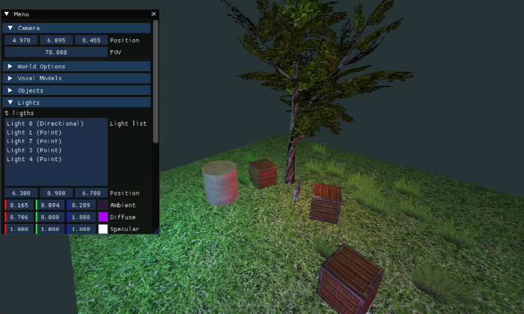
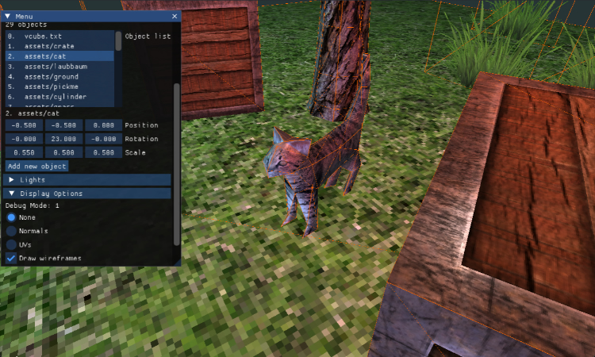

# OpenGL 3D engine

A simple OpenGL-based 3D rendering engine. Work in progress.

Features include:
- Phong shading with ambient, diffuse and specular components.
- Multiple light types, dynamic lighting system powered by UBOs.
- Model loading via [assimp](https://github.com/assimp/assimp) library.
- Voxel model support with greedy meshing (WIP).
- Debugging GUI built with [ImGui](https://github.com/ocornut/imgui).

